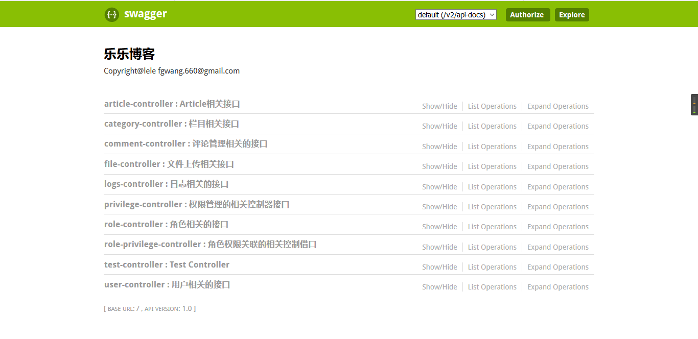
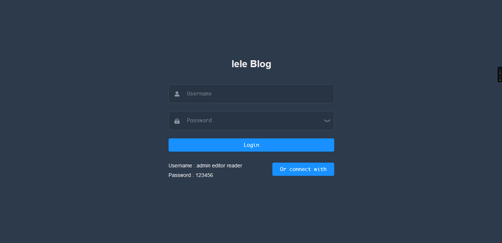

# leleblog系统

> 基于SpringBoot项目的博客系统

## 使用到的技术
* Spring-boot
* mybatis
* mybati-generator
* spring IOC
* spring AOP
* spring MVC
* swagger2
* jwt
* poi
* fastDfs

## 实现的功能

| 功能菜单 |                      具体实现                      |
| :------: | :------------------------------------------------: |
| 文章管理 |            发布、查看、删除、修改评论等            |
| 栏目管理 |          新增、查看、删除(可以批量)、修改          |
| 评论管理 |                  查看、删除、审核                  |
| 用户管理 |           筛选查找、审核、删除、设置角色           |
| 角色管理 |            添加、查看、删除、修改、授权            |
| 权限管理 |          查询权限树、添加、删除、修改权限          |
| 日志管理 | 记录用户操作，包括用户访问的(时间、ip、类、方法等) |


## 运行项目

```sh
mvn spring-boot:run
```


## 效果图

[swagger接口界面](http://47.103.215.243:8888/swagger-ui.html)



[前台页面演示(已对接)](http://47.103.215.243/leleblog)


